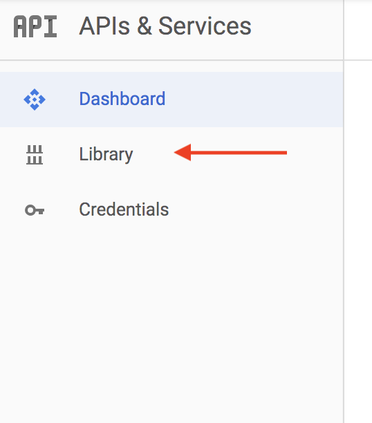
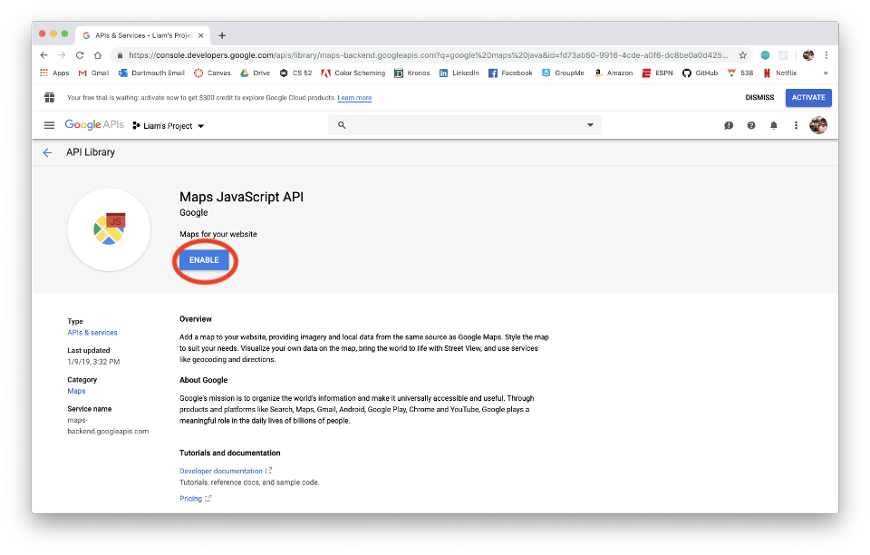
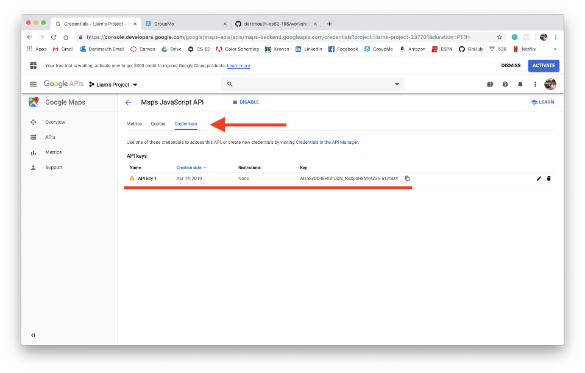

# CS52 Workshops:  Map APIs: Google Maps, Leaflet and Mapbox


Maps are everywhere :rainbow: We'd be lost without the maps on our phone, and apps from Uber to Snapchat wouldn't work without the capabilities of these APIs. Map APIs give us data we couldn't get otherwise like routing and time estimation, produce cool data visualizations and construct augmented reality. The best part is, it's pretty easy for us to take advantage of all their cool features too :smiley_cat:

## Overview

For this demo, we're going to be writing a react app that utilizes the Google Maps API. First, we're going to learn how to loading a map to a react project. Then, we'll center and zoom in on Dartmouth. Next, we're going to drop markers, with personalized info boxes on our map. Lastly, we're going to create a shape data visualization based on our points! 

## Setup

Clone the workshop repository and `cd workshop-ws-04-23-maps`. Then run `yarn install`. We need to install all the dependencies from the package.json file. Then run `yarn start` to make sure everything's looking good :sunglasses: 

:rocket: We're using a different "starter-pack." This one is called **create react app** and it's used by front end developers to quickly create a complete react development environemnt. Though our starter pack is great, this one has a few more things we're going to need.

The next step is to install the google maps react library so we can use google maps within our react app! This is a wrapper that uses the Google Maps API and it makes it compatable with react projects. We do this by running `yarn add google-maps-react`

Since we're using an API, we need to fetch an API key, just like we did for the Youtube API in Short Assignment 4. To do this you should head to http://console.developers.google.com

1. Select **Library** on the lefthand, invisable menu and you should see a screen like this:



2. Next, search for "Google Maps JavaScript API" it should look like this and then click on it:


3. Once you've clicked on the "Google Maps JavaScript API" click enable to enable that API



4. You'll be taken to a screen that looks something like this. Because we all have google projects from SA 4, we don't need to make a new one. Click on **Credentials** and your API key should be listed! 



:warning: Copy your API key because you're going to need it soon!

## Step by Step

Now that everything's set up, we're going to start adding to our application. Throughout building you can run `yarn start` to see your changes in real time!


* Explanations of the what **and** the why behind each step. Try to include:
  * higher level concepts
  * best practices

Remember to explain any notation you are using.

```javascript
/* and use code blocks for any code! */
```


:sunglasses: GitHub markdown files [support emoji notation](http://www.emoji-cheat-sheet.com/)

Here's a resource for [github markdown](https://guides.github.com/features/mastering-markdown/).

## Summary 

**What your site has:**

* [ ] A map, that is centered around a certain point and zoomed in to a level you like
* [ ] At least one marker of a point of your choosing, with a custom info box
* [ ] A list of points that will become the outline for your custom shape
* [ ] A shape whose points are those you selected in the list above

**Extra Credit** Your graph centers around somewhere that isn't Dartmouth and/or style your map to make it your own :sunglasses:

**What you learned:**

* [ ] What an API is and what map APIs are capable of
* [ ] The pros and cons of the different map API options (Leaflet, Mapbox, Google Maps)
* [ ] Adding a map to your React app and customizing the location, zoom and pins
* [ ] Leveraging a data set to produce cool data visualtions with the Google Maps API
* [ ] Styling your map to be your own!

## Reflection

:bulb: Remember to submit these on canvas!

* [ ] Explain the basic idea of how these map APIs work.
* [ ] Can you think of any instances where you would use a map API in a web or mobile app? For one of those examples, which API (Leaflet, Mapbox, Google Maps) would you choose and why?

## Resources

* https://developers.google.com/maps/documentation/
* https://trends.builtwith.com/websitelist/Google-Maps-API
* https://www.datanyze.com/market-share/mapping-and-gis/United%20States/google-maps-api-market-share
* https://jungleworks.com/google-vs-mapbox/
* https://leafletjs.com/
* https://www.mapbox.com/
* https://www.fullstackreact.com/articles/how-to-write-a-google-maps-react-component/#the-map-container-component

## Link to our Power Point

https://docs.google.com/presentation/d/1kFYbvW4CdcYt7os8FXeKOqM1Vs_y9IbsqyPxfru8Y6E/edit?usp=sharing